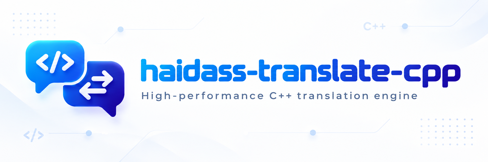

# haidass-translate-cpp



Pure C++17 inference engine for [Haidass-Translate-143M](https://huggingface.co/DALabCommunity/Haidass-Translate-143M) (Chinese ↔ English translation). **Zero third-party C++ dependencies** — standard library + threads only. Two delivery modes:

- **File-loading mode**: load GGUF weights at runtime via `-m model.gguf` (mmap, near-zero copy).
- **Embedded single-file mode**: weights are linked into the binary at build time, producing one **fully self-contained executable** with no external files.

[中文文档](README_CN.md)

## Features

- Qwen3 architecture (30 layers / hidden 576 / GQA 9Q-3KV / QK-Norm / RoPE), all-F32 compute (the official report shows fp16 activations overflow)
- Reads the official GGUF directly (Q8_0, 188 MB, from [umeiko/Haidass-Translate-143M-GGUF](https://huggingface.co/umeiko/Haidass-Translate-143M-GGUF))
- Built-in tokenizer replicating llama.cpp's SPM-session semantics exactly (special-token pre-splitting, ▁ prefix on every raw segment, score-heap merging, `<0xXX>` byte fallback) — token-for-token identical to training
- SIMD: AVX2/FMA (x86-64) and NEON (ARM) in separate translation units with runtime dispatch; a portable scalar fallback runs anywhere, including RISC-V
- Multithreaded batch GEMM (Q8_0 dequant × F32)
- Output matches HF transformers (same Q8_0 checkpoint) **verbatim**; logits cosine = 1.000000

## Quick start

### Download the weights

```bash
python tools/download_model.py        # downloads Q8_0 into models/
# or manually: https://huggingface.co/umeiko/Haidass-Translate-143M-GGUF
```

### Build (file-loading mode)

```bash
cmake -S . -B build -G Ninja -DCMAKE_BUILD_TYPE=Release
cmake --build build -j
```

Windows MSVC: drop `-G Ninja` to use the default Visual Studio generator, then
`cmake --build build --config Release`. For a step-by-step local Windows build
(PowerShell/cmd, uses the CMake+Ninja bundled with VS BuildTools), see
[docs/BUILD_WINDOWS.md](docs/BUILD_WINDOWS.md).

Minimal fallback without CMake (MinGW/MSYS2): `bash scripts/build_mingw.sh`.
Step-by-step Windows MinGW guide (where to get the compiler, MSYS2 vs winlibs):
[docs/BUILD_WINDOWS_MINGW.md](docs/BUILD_WINDOWS_MINGW.md).

### Build (embedded single-file mode)

```bash
cmake -S . -B build-embed -G Ninja -DCMAKE_BUILD_TYPE=Release \
  -DHAIDASS_BUILD_TESTS=OFF \
  -DHAIDASS_EMBED_MODEL=/path/to/haidass-translate-143m-q8_0.gguf
cmake --build build-embed -j
# => a single haidass executable (~188 MB) with the weights inside
```

GCC/Clang/MinGW embed via `.incbin`, MSVC via a Windows `.rc` resource; the same GGUF parser is shared by both modes, with zero parsing overhead at runtime — the weights sit in a read-only mapped section.

### Usage

```bash
./build/haidass -m models/haidass-translate-143m-q8_0.gguf "Machine translation bridges languages and cultures."
# => 机器翻译跨越语言和文化。

./build/haidass -m models/haidass-translate-143m-q8_0.gguf "机器翻译连接了不同的语言与文化。"
# => Machine translation connects different languages and cultures.

echo "Hello" | ./build/haidass -m model.gguf     # stdin works too
./build-embed/haidass "你好世界"                  # embedded build: no -m needed
```

Direction is auto-detected (any CJK input ⇒ zh→en); force with `--en2zh` / `--zh2en`. Greedy decoding by default; `--temp/--top-k/--top-p/--seed` enable sampling. Full options: `--help`.

## Cross-compilation

Ready-made toolchain files (fully static linking):

```bash
cmake -S . -B build-arm64 -DCMAKE_TOOLCHAIN_FILE=cmake/toolchains/aarch64-linux-gnu.cmake
cmake -S . -B build-armhf -DCMAKE_TOOLCHAIN_FILE=cmake/toolchains/arm-linux-gnueabihf.cmake
cmake -S . -B build-riscv -DCMAKE_TOOLCHAIN_FILE=cmake/toolchains/riscv64-linux-gnu.cmake
cmake -S . -B build-win   -DCMAKE_TOOLCHAIN_FILE=cmake/toolchains/x86_64-w64-mingw32.cmake
```

CI covers Linux x86_64 / aarch64 / armhf / riscv64, macOS x86_64 / arm64, and Windows MSVC (x64/x86) / MinGW; cross targets run the full test suite under qemu-user. Pushing a `v*` tag triggers the release workflow, which publishes per-platform zips (file-loading + embedded) to GitHub Releases.

## Testing

```bash
ctest --test-dir build --output-on-failure
```

7 tests: GGUF parsing, tokenizer (diffed against a llama.cpp-semantics reference), operators, forward logits of a synthetic fixture model against a numpy reference, and end-to-end generation. `tools/verify_vs_hf.py` additionally compares the whole model against HF transformers loading the same GGUF (needs `pip install -r tools/requirements.txt` + torch/transformers).

## Performance

Q8_0 model, greedy decoding: about **40 tok/s** on a desktop x86-64 (AVX2, 24 threads). At 143M parameters the model is practical on ARM and RISC-V boards too.

## Architecture

```
src/
  platform.{h,cpp}     OS abstraction: mmap/files, UTF-8 console, thread count
  gguf.{h,cpp}         GGUF v3 parser (shared by both delivery modes)
  tokenizer.{h,cpp}    llama.cpp SPM-session tokenizer
  kernels.h            kernel interface (GEMM etc.)
  kernels_scalar.cpp   portable scalar reference kernels
  kernels_avx2.cpp     AVX2/FMA (own TU, -mavx2 -mfma)
  kernels_neon.cpp     NEON (own TU)
  cpu_dispatch.cpp     runtime dispatch (cpuid / HWCAP)
  thread_pool.{h,cpp}  minimal thread pool
  model.{h,cpp}        Qwen3 forward + KV cache + weight views
  ops.{h,cpp}          rmsnorm / rope / attention / silu etc.
  sampler.{h,cpp}      greedy / top-k / top-p sampling
  generate.{h,cpp}     generation loop (chat template, EOS handling)
  main.cpp             CLI
  embed_{none,asm,res}.cpp  three embed backends (none / .incbin / .rc)
tools/                 Python utilities: download, fixture/vector generation, HF comparison
tests/                 C++ tests + committed vocab.bin (extracted from the official GGUF)
cmake/toolchains/      cross-compilation toolchain files
```

## Acknowledgements

- Model: [DALabCommunity/Haidass-Translate-143M](https://huggingface.co/DALabCommunity/Haidass-Translate-143M)
- GGUF quantization: [umeiko/Haidass-Translate-143M-GGUF](https://huggingface.co/umeiko/Haidass-Translate-143M-GGUF)
- Tokenizer semantics reference: [llama.cpp](https://github.com/ggml-org/llama.cpp)
